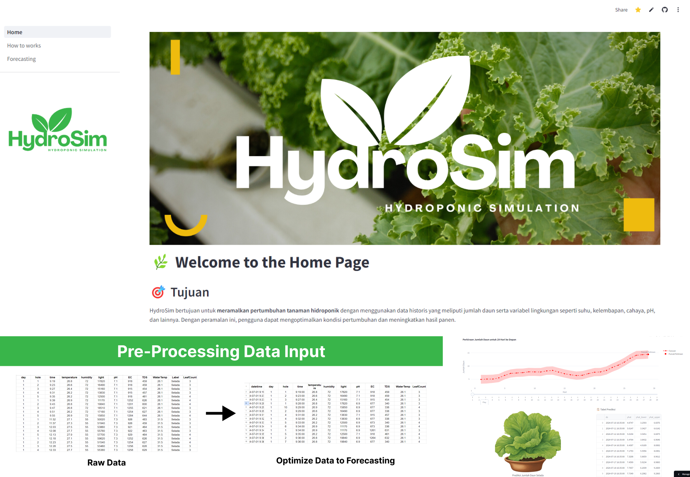

# Hydrosim



## Pertama Kali Menggunakan Project Ini?

Berikut adalah langkah-langkah untuk menjalankan project ini. Pastikan menggunakan Python versi 3.11.0 - 3.11.9.

### Copy or Clone the project

```bash
git clone https://github.com/Vinzzztty/Forecasting-Hidroponik .
```

### Buat virtual-environment terlebih dahulu

```bash
python -m venv .venv
```

### Activate virtual-environment

```bash
.\.venv\Scripts\activate
```

### Install package dan dependecies

```bash
pip install -r requirements.txt
```

### Run the project

```bash
streamlit run Home.py
```
